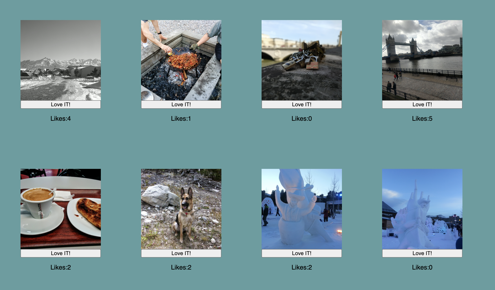

# REACT Gallery

## Description

This is my first react app. For this project I took a gallery of photos and rendered them to the DOM using react. I created two components to send props to. The user is able to view the photos, like photos, and click on each individual image to view the description. The styling is not the greatest by I am proud of the logic. 

Tech used: 

* React
* HTML
* CSS
* javaScript 
* Node.js

## Thank You

I would like to give a special shoutout to dEv Jana and my other instructors at Prime Academy for teaching me the skills and creating the requirements for this project.  
